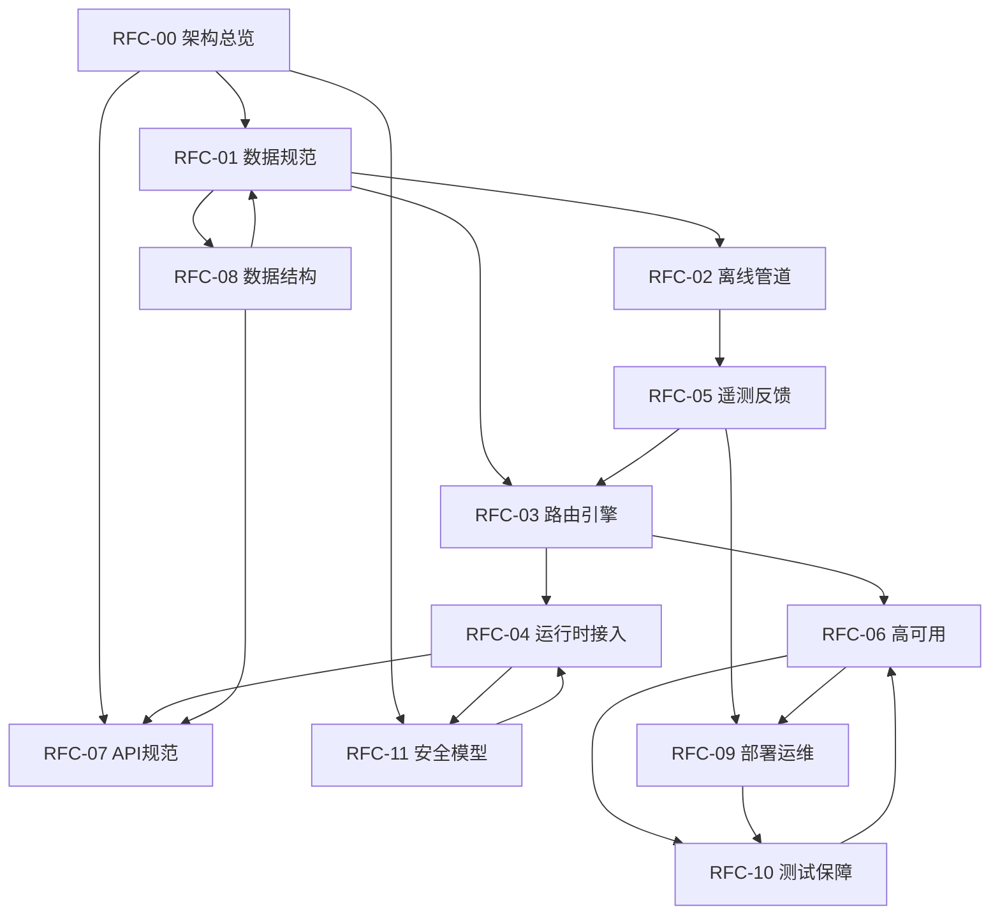

# RFC-00: GraphSkill 架构总览与索引

**文档编号:** RFC-00  
**版本:** 2.0.0
**状态:** 正式发布
**最后更新:** 2026-04-17
**作者:** GraphSkill Architecture Team  
**分类:** 架构规范 - 总览

---

## 目录

1. [概述](#1-概述)
2. [术语定义](#2-术语定义)
3. [系统定位与设计理念](#3-系统定位与设计理念)
4. [核心架构组件](#4-核心架构组件)
5. [数据流总览](#5-数据流总览)
6. [技术栈选型](#6-技术栈选型)
7. [系统边界与外部依赖](#7-系统边界与外部依赖)
8. [非功能性需求](#8-非功能性需求)
9. [RFC 文档索引](#9-rfc-文档索引)
10. [版本历史](#10-版本历史)

---

## 1. 概述

### 1.1 文档目的

本文档作为 GraphSkill 项目的架构总览与索引文档（RFC-00），旨在为开发团队、运维团队和利益相关者提供系统的宏观架构视图。本文档定义了系统的核心设计理念、组件拓扑关系、数据流向、技术栈选型依据，并作为所有其他 RFC 文档的导航入口。

### 1.2 适用范围

本文档适用于以下角色：
- 系统架构师：理解整体设计决策
- 后端开发工程师：理解组件交互与接口边界
- DevOps 工程师：规划部署与运维策略
- 安全工程师：评估系统安全边界
- 技术决策者：评估技术选型合理性

### 1.3 规范用语约定

本文档严格遵循 IETF RFC 2119 规范用语。以下关键词具有特定含义：

| 关键词 | 含义 |
|--------|------|
| **MUST** / **REQUIRED** / **SHALL** | 绝对要求，任何偏离都将导致系统不合规 |
| **MUST NOT** / **SHALL NOT** | 绝对禁止，违反将导致系统不可接受 |
| **SHOULD** / **RECOMMENDED** | 推荐做法，特殊情况下可偏离但需文档记录理由 |
| **SHOULD NOT** / **NOT RECOMMENDED** | 不推荐做法，特殊情况下可采用但需文档记录理由 |
| **MAY** / **OPTIONAL** | 可选项，由实现者自行决定 |

---

## 2. 术语定义

本节定义 GraphSkill 系统中使用的核心术语。所有 RFC 文档 MUST 遵循本节定义的术语规范。

### 2.1 核心概念

| 术语 | 定义 |
|------|------|
| **过程性知识 (Procedural Knowledge)** | 指导 Agent 执行特定任务的技能知识，包含条件判断、循环逻辑、API 调用序列等可执行指令，区别于声明性知识（Declarative Knowledge）。 |
| **技能文件 (Skill File)** | 以 `SKILL.md` 格式存储的过程性知识单元，包含 YAML Frontmatter 元数据和 Markdown 格式的技能描述与执行指令。 |
| **技能清单 (Skill Manifest)** | 技能文件的 YAML Frontmatter 部分，声明技能的元数据、依赖关系、权限需求等结构化信息。 |
| **拓扑感知 (Topology-Aware)** | 系统能够识别并利用技能节点之间的依赖（REQUIRES）、互斥（CONFLICTS_WITH）、增强（ENHANCES）、替代（SUBSTITUTES）关系进行决策。 |
| **动态路由 (Dynamic Routing)** | 根据运行时上下文状态，实时计算并返回最小必要技能子集的过程。 |
| **最小必要上下文 (Minimum Viable Context, MVC)** | 经过冲突消解和依赖解析后，能够支撑当前任务执行的最小技能集合，确保零冲突、高内聚。 |

### 2.2 图论术语

| 术语 | 定义 |
|------|------|
| **技能节点 (Skill Node)** | 图数据库中表示单个技能的节点实体，包含 `skill_id`、`embedding_id`、`execution_success_rate` 等属性。 |
| **依赖边 (REQUIRES Edge)** | 有向边，表示源节点依赖目标节点。若 `A -[:REQUIRES]-> B`，则调度 A 时 MUST 同时载入 B。 |
| **互斥边 (CONFLICTS_WITH Edge)** | 无向边，表示两个技能逻辑互斥，MUST NOT 同时出现在同一上下文中。 |
| **增强边 (ENHANCES Edge)** | 有向边，表示目标节点能提升源节点的执行成功率，属于软依赖。 |
| **替代边 (SUBSTITUTES Edge)** | 无向边，表示两个技能功能相似，同一子图中 SHOULD 只保留其一。 |
| **冲突图 (Conflict Graph)** | 由 `CONFLICTS_WITH` 和 `SUBSTITUTES` 边构成的子图，用于冲突消解算法。 |
| **最大权重独立集 (Maximum Weight Independent Set, MWIS)** | 图论问题，在冲突图中选取权重之和最大的节点子集，且子集内任意两节点无边相连。 |

### 2.3 系统组件术语

| 术语 | 定义 |
|------|------|
| **Ingestion Engine** | 数据摄入引擎，负责离线解析技能文件、提取拓扑关系、构建知识图谱。 |
| **Graph-Vector Store** | 图向量混合存储层，提供图数据库和向量数据库的强一致性双模存储。 |
| **Routing Gateway** | 动态路由网关，处理实时查询请求，执行混合召回与冲突剪枝算法。 |
| **Telemetry & Feedback** | 遥测与反馈总线，收集运行时数据，实现图谱边权重的动态调整与自我进化。 |

---

## 3. 系统定位与设计理念

### 3.1 系统定位

GraphSkill 定位为 LLM Agent 生态系统中的**Vector-RAG 增量优化中间件**。系统位于 Agent 核心大脑（LLM）与外部工具/环境之间，**不与 Vector-RAG 竞争，而是在 Vector-RAG 检索结果之上构建图处理层**，通过依赖扩展和冲突消解对 VR baseline 进行增量优化，数学保证 GraphSkill ≥ Vector-RAG（GS ≥ VR）。

> **范式转变声明**：传统 Graph RAG 方法试图从零构建检索结果（ANN seed → BFS expansion → scoring → pruning），这种"图优先"架构有致命缺陷：BFS expansion 引入的噪声会抵消 ANN seed 的价值，导致 GS ≈ Zero-shot 或 GS < VR。新范式采用"VR-优先"架构：第一步执行标准 Vector-RAG（ANN top-K），第二步在 VR 结果之上做图增强（依赖扩展 + 冲突消解）。最差情况 fallback 到 VR baseline，保证 GS ≥ VR。

```
┌─────────────────────────────────────────────────────────────────┐
│                        LLM Agent Ecosystem                      │
├─────────────────────────────────────────────────────────────────┤
│                                                                 │
│  ┌─────────────┐    ┌─────────────────────┐    ┌─────────────┐ │
│  │             │    │                     │    │             │ │
│  │  User Query │───▶│   GraphSkill        │───▶│  LLM Brain  │ │
│  │             │    │   (Middleware)      │    │             │ │
│  └─────────────┘    │                     │    └─────────────┘ │
│                     │  ┌───────────────┐  │                      │
│                     │  │ Routing       │  │                      │
│                     │  │ Gateway       │  │                      │
│                     │  └───────┬───────┘  │                      │
│                     │          │          │                      │
│                     │  ┌───────▼───────┐  │                      │
│                     │  │ Graph-Vector  │  │                      │
│                     │  │ Store         │  │                      │
│                     │  └───────┬───────┘  │                      │
│                     │          │          │                      │
│                     │  ┌───────▼───────┐  │                      │
│                     │  │ Ingestion     │  │                      │
│                     │  │ Engine        │  │                      │
│                     │  └───────────────┘  │                      │
│                     └─────────────────────┘                      │
│                              │                                   │
│                     ┌────────▼────────┐                          │
│                     │  Skill Files    │                          │
│                     │  (SKILL.md)     │                          │
│                     └─────────────────┘                          │
└─────────────────────────────────────────────────────────────────┘
```

### 3.2 核心设计理念

#### 3.2.1 摒弃盲目全量加载

传统 Agent 系统往往采用全量技能加载策略，将所有可用技能一次性注入 Prompt 上下文。这种做法导致：
- **注意力稀释**：LLM 在海量技能描述中难以聚焦关键信息
- **Token 浪费**：大量无关技能占用宝贵的上下文窗口
- **逻辑死锁**：互斥技能同时存在导致 Agent 行为冲突

GraphSkill MUST 采用按需加载策略，仅返回当前任务必需的最小技能子集。

#### 3.2.2 VR-First 图增强层

GraphSkill **不替代** Vector-RAG，而是在 VR 检索结果之上构建图增强层。传统 Vector-only RAG 存在三个问题：
- **依赖缺失**：召回"提交代码"技能但遗漏"配置 Git"前置依赖
- **冲突引入**：同时召回互斥技能导致执行失败
- **冗余加载**：功能相似的替代技能被重复加载

GraphSkill MUST 在 VR baseline 基础上，叠加 1-hop 依赖扩展与 MWIS 冲突消解。**VR seed 集合享有保护优先级**——图增强层只能在此基础上增删，不能丢弃 VR 的核心结果。这保证了 GS ≥ VR 的数学不变量。

#### 3.2.2a GS ≥ VR 保证机制

系统 MUST 保证以下不变量：在任何情况下，GraphSkill 的端到端效果不低于 Vector-RAG baseline。

保证策略：
1. **VR Seed Protection**：MWIS pruning 时，VR seed skills 享有保护优先级——即使与扩展技能冲突，也不被移除（仅被更高分的 VR seed 替代）
2. **Fallback Guarantee**：如果图增强层未产生有价值的变化（enhancement_score ≤ 0），系统 MUST 返回 VR baseline 结果而非降级到 Zero-shot
3. **1-hop Limit**：图扩展 MUST 限制为 1-hop（而非 2-hop），避免噪声扩张抵消 VR seed 的价值

数学论证：最差情况下 S_final = S_VR（图增强无增量），此时 GS 注入内容与 VR 完全相同 → GS E2E = VR E2E。

#### 3.2.3 拓扑感知与冲突消解

系统 MUST 维护技能节点之间的四类拓扑关系：
1. **REQUIRES（强依赖）**：硬性前置条件，MUST 满足
2. **CONFLICTS_WITH（互斥）**：逻辑冲突，MUST NOT 同时存在
3. **ENHANCES（增强）**：软性相关，SHOULD 在 Token 预算充足时加载
4. **SUBSTITUTES（替代）**：功能相似，SHOULD 只保留其一

系统 MUST 在返回结果前执行冲突消解算法，确保输出技能子集内零冲突。

#### 3.2.4 运行时自我进化

系统 SHOULD 具备基于遥测数据的自我进化能力：
- 根据技能执行成功率动态调整节点权重
- 自动发现隐性依赖关系并构建增强边
- 检测死锁行为并自动标记冲突边

---

## 4. 核心架构组件

GraphSkill 系统由四大核心微服务集群构成。各组件 MUST 严格遵循本节定义的职责边界。

### 4.1 组件架构图

```
┌─────────────────────────────────────────────────────────────────────────────┐
│                           GraphSkill Architecture                            │
├─────────────────────────────────────────────────────────────────────────────┤
│                                                                             │
│  ┌─────────────────────────────────────────────────────────────────────┐   │
│  │                        Offline Layer (离线层)                        │   │
│  │  ┌─────────────────────────────────────────────────────────────┐   │   │
│  │  │                   Ingestion Engine                           │   │   │
│  │  │  ┌─────────────┐  ┌─────────────┐  ┌─────────────────────┐  │   │   │
│  │  │  │ File        │  │ AST Parser  │  │ Topology Extractor  │  │   │   │
│  │  │  │ Watcher     │──▶│ (Tree-sitter)│──▶│ (LLM-based)        │  │   │   │
│  │  │  └─────────────┘  └─────────────┘  └─────────────────────┘  │   │   │
│  │  │         │                                    │              │   │   │
│  │  │         ▼                                    ▼              │   │   │
│  │  │  ┌─────────────┐                    ┌─────────────────────┐│   │   │
│  │  │  │ Static      │                    │ DAG Validator       ││   │   │
│  │  │  │ Validator   │                    │ (Cycle Detection)   ││   │   │
│  │  │  └─────────────┘                    └─────────────────────┘│   │   │
│  │  └─────────────────────────────────────────────────────────────┘   │   │
│  └─────────────────────────────────────────────────────────────────────┘   │
│                                      │                                      │
│                                      ▼                                      │
│  ┌─────────────────────────────────────────────────────────────────────┐   │
│  │                        Storage Layer (存储层)                        │   │
│  │  ┌─────────────────────────────────────────────────────────────┐   │   │
│  │  │                   Graph-Vector Store                         │   │   │
│  │  │  ┌───────────────────┐      ┌───────────────────────────┐  │   │   │
│  │  │  │   Graph Database  │◀────▶│   Vector Database         │  │   │   │
│  │  │  │   (Neo4j/Memgraph)│      │   (Milvus/Qdrant)         │  │   │   │
│  │  │  └───────────────────┘      └───────────────────────────┘  │   │   │
│  │  │           │                          │                    │   │   │
│  │  │           ▼                          ▼                    │   │   │
│  │  │  ┌─────────────────────────────────────────────────────┐  │   │   │
│  │  │  │              Transaction Manager                    │  │   │   │
│  │  │  │         (Dual-Write Consistency Guarantee)          │  │   │   │
│  │  │  └─────────────────────────────────────────────────────┘  │   │   │
│  │  └─────────────────────────────────────────────────────────────┘   │   │
│  └─────────────────────────────────────────────────────────────────────┘   │
│                                      │                                      │
│                                      ▼                                      │
│  ┌─────────────────────────────────────────────────────────────────────┐   │
│  │                        Online Layer (在线层)                         │   │
│  │  ┌─────────────────────────────────────────────────────────────┐   │   │
│  │  │                   Routing Gateway - VR-First                   │   │   │
│  │  │  ┌──────────────────────────────────────────────────────┐  │   │   │
│  │  │  │ STEP 1: VR Baseline Retrieval - ANN top-5            │  │   │   │
│  │  │  │   Query Processor → Embedding → Vector Search         │  │   │   │
│  │  │  └──────────────────────┬───────────────────────────────┘  │   │   │
│  │  │                         │ VR seed skills                   │   │   │
│  │  │                         ▼                                   │   │   │
│  │  │  ┌──────────────────────────────────────────────────────┐  │   │   │
│  │  │  │ STEP 2: Graph Enhancement - 1-hop expansion          │  │   │   │
│  │  │  │   Hybrid Retriever → Scoring → MWIS + VR Protection  │  │   │   │
│  │  │  └──────────────────────┬───────────────────────────────┘  │   │   │
│  │  │                         │ enhanced or fallback            │   │   │
│  │  │                         ▼                                   │   │   │
│  │  │  ┌──────────────────────────────────────────────────────┐  │   │   │
│  │  │  │ STEP 3: Context Assembly - topo sort + budget         │  │   │   │
│  │  │  │   Context Assembler → VR seeds first → enhanced next │  │   │   │
│  │  │  └──────────────────────┬───────────────────────────────┘  │   │   │
│  │  │                         │ fallback: VR baseline if        │   │   │
│  │  │                         │ enhancement ineffective         │   │   │
│  │  │  ┌──────────────────────────────────────────────────────┐  │   │   │
│  │  │  │ STEP 4: Fallback Guarantee - GS ≥ VR always          │  │   │   │
│  │  │  │   Return VR baseline if enhancement_score ≤ 0        │  │   │   │
│  │  │  └──────────────────────────────────────────────────────┘  │   │   │
│  │  └─────────────────────────────────────────────────────────────┘   │   │
│  └─────────────────────────────────────────────────────────────────────┘   │
│                                      │                                      │
│                                      ▼                                      │
│  ┌─────────────────────────────────────────────────────────────────────┐   │
│  │                     Runtime Layer (运行时层)                         │   │
│  │  ┌─────────────────────────────────────────────────────────────┐   │   │
│  │  │                Telemetry & Feedback Bus                     │   │   │
│  │  │  ┌─────────────┐  ┌─────────────┐  ┌─────────────────────┐  │   │   │
│  │  │  │ Tracer      │  │ Kafka       │  │ Weight Adjuster    │  │   │   │
│  │  │  │ (埋点)       │──▶│ Consumer    │──▶│ (RL-based)         │  │   │   │
│  │  │  └─────────────┘  └─────────────┘  └─────────────────────┘  │   │   │
│  │  │         │                                    │              │   │   │
│  │  │         ▼                                    ▼              │   │   │
│  │  │  ┌─────────────┐                    ┌─────────────────────┐│   │   │
│  │  │  │ Metrics     │                    │ Implicit Edge       ││   │   │
│  │  │  │ Collector   │                    │ Discovery           ││   │   │
│  │  │  └─────────────┘                    └─────────────────────┘│   │   │
│  │  └─────────────────────────────────────────────────────────────┘   │   │
│  └─────────────────────────────────────────────────────────────────────┘   │
│                                                                             │
└─────────────────────────────────────────────────────────────────────────────┘
```

### 4.2 Ingestion Engine（数据摄入引擎）

**职责定义：** 负责离线或异步解析技能仓库，进行静态检查、安全校验，并提取拓扑关系。

**核心功能：**
| 功能模块 | 描述 | 规范要求 |
|----------|------|----------|
| File Watcher | 监听文件系统/Git Hook，检测技能文件变更 | MUST 支持 Git Hook 集成 |
| AST Parser | 基于 Tree-sitter 构建 Markdown 解析器 | MUST 分离描述域与代码域 |
| Static Validator | 执行 Frontmatter Schema 校验、权限声明检查 | MUST 拒绝不合规数据 |
| Topology Extractor | 基于 LLM 自动推演技能间拓扑关系 | SHOULD 仅在置信度 > 0.85 时自动写入 |
| DAG Validator | 执行环路检测，确保 REQUIRES 子图无环 | MUST 在事务提交前执行 |

**接口边界：**
- 输入：`SKILL.md` 文件（本地文件系统或 Git 仓库）
- 输出：结构化节点数据 + 边关系数据 → Graph-Vector Store

**详细规范：** 参见 [RFC-02: 离线图谱构建管道](#rfc-02-离线图谱构建管道)

### 4.3 Graph-Vector Store（图向量混合存储层）

**职责定义：** 系统的持久化核心，负责双模数据的强一致性存储。

**核心功能：**
| 功能模块 | 描述 | 规范要求 |
|----------|------|----------|
| Graph Database | 存储技能节点与拓扑边关系 | MUST 支持 Cypher 查询语言 |
| Vector Database | 存储技能描述的高维向量嵌入 | MUST 支持 HNSW 索引架构 |
| Transaction Manager | 保障图-向量双写一致性 | MUST 实现分布式事务或补偿机制 |
| Index Manager | 管理图索引与向量索引 | MUST 支持增量索引更新 |

**接口边界：**
- 输入：结构化节点/边数据（来自 Ingestion Engine）
- 输出：节点/边查询结果、向量相似度搜索结果（供 Routing Gateway 消费）

**详细规范：** 参见 [RFC-01: 数据规范与存储层设计](#rfc-01-数据规范与存储层设计)

### 4.4 Routing Gateway（动态路由网关）

**职责定义：** 核心在线服务，处理实时 Query，执行图谱扩展与冲突剪枝算法。

**核心功能：**
| 功能模块 | 描述 | 规范要求 |
|----------|------|----------|
| Query Processor | 标准化输入、意图向量化 | MUST 在 50ms 内完成向量化 |
| Hybrid Retriever | 语义种子召回 + 图谱多跳扩展 | MUST 在 200ms 内完成召回 |
| Conflict Pruner | 基于 MWIS 算法的冲突消解 | MUST 确保输出零冲突 |
| Context Assembler | 拓扑排序、Token 截断、上下文拼装 | MUST 遵守 Token 预算限制 |

**接口边界：**
- 输入：用户 Query + 上下文状态 + Token 预算
- 输出：结构化技能上下文（XML/JSON 格式）

**详细规范：** 参见 [RFC-03: 在线动态路由引擎](#rfc-03-在线动态路由引擎)

### 4.5 Telemetry & Feedback（遥测与反馈总线）

**职责定义：** 收集运行时数据，实现图谱边权重的动态调整与自我进化。

**核心功能：**
| 功能模块 | 描述 | 规范要求 |
|----------|------|----------|
| Tracer | Agent 执行阶段埋点 | MUST 记录每次技能调用的状态 |
| Metrics Collector | 聚合成功率、延迟等指标 | SHOULD 支持实时仪表盘 |
| Weight Adjuster | 基于强化学习的边权重动态修正 | SHOULD 实现可靠性衰减机制 |
| Implicit Edge Discovery | 挖掘隐性依赖关系 | MAY 自动构建 ENHANCES 边 |

**接口边界：**
- 输入：Agent 执行遥测数据（Kafka Topic）
- 输出：边权重更新指令 → Graph-Vector Store

**详细规范：** 参见 [RFC-05: 遥测监控与自我进化反馈循环](#rfc-05-遥测监控与自我进化反馈循环)

---

## 5. 数据流总览

### 5.1 离线数据摄入流程

```
┌─────────────┐     ┌─────────────┐     ┌─────────────┐     ┌─────────────┐
│  SKILL.md   │────▶│  File       │────▶│  AST        │────▶│  Static     │
│  (文件)     │     │  Watcher    │     │  Parser     │     │  Validator  │
└─────────────┘     └─────────────┘     └─────────────┘     └─────────────┘
                                                                   │
                                                                   ▼
┌─────────────┐     ┌─────────────┐     ┌─────────────┐     ┌─────────────┐
│  Graph-     │◀────│  Embedding  │◀────│  Topology   │◀────│  DAG        │
│  Vector     │     │  Generator  │     │  Extractor  │     │  Validator  │
│  Store      │     │             │     │             │     │             │
└─────────────┘     └─────────────┘     └─────────────┘     └─────────────┘
```

**流程说明：**
1. File Watcher 检测到 `SKILL.md` 文件变更
2. AST Parser 解析 Markdown，提取 Frontmatter 与内容
3. Static Validator 校验 Schema 合规性
4. DAG Validator 检查依赖关系是否存在环路
5. Topology Extractor 基于 LLM 推演隐性拓扑关系
6. Embedding Generator 生成技能描述向量
7. 双写事务将节点/边数据写入 Graph-Vector Store

### 5.2 在线路由流程（VR-First Architecture）

```
┌─────────────┐     ┌─────────────┐     ┌─────────────┐     ┌─────────────┐
│  Agent      │────▶│  Query      │────▶│  Embedding  │────▶│  VR Baseline│
│  Query      │     │  Processor  │     │  Service    │     │  ANN Top-5  │
└─────────────┘     └─────────────┘     └─────────────┘     └─────────────┘
                                                                    │
                              S_VR = ANN-TopK(q, K=5)              │
                              VR seed skills - ALWAYS RETAINED      ▼
┌─────────────────────────────────────────────────────────────────────────┐
│                      STEP 2: Graph Enhancement Layer                     │
│  ┌─────────────┐     ┌─────────────┐     ┌─────────────────────────┐  │
│  │  1-hop      │────▶│  Scoring    │────▶│  MWIS + VR Protection   │  │
│  │  Expansion  │     │  α=0.8      │     │  VR seeds不可被pruning  │  │
│  └─────────────┘     └─────────────┘     └─────────────────────────┘  │
└─────────────────────────────────────────────────────────────────────────┘
                                                                    │
                    enhancement_score > 0 ?                          │
                              │                                      │
                    ┌─────────┼─────────┐                            │
                    │ YES               │ NO                         │
                    ▼                   ▼                            │
┌─────────────┐     ┌─────────────┐     ┌─────────────┐             │
│  Context    │     │  Fallback:  │     │  Context    │             │
│  Assembler  │     │  VR Only    │     │  Assembler  │             │
│  VR+enhanced│     │  GS = VR    │     │  VR seeds   │             │
└─────────────┘     └─────────────┘     └─────────────┘             │
                    │                   │                            │
                    └─────────┬─────────┘                            │
                              ▼                                      │
                    ┌─────────────┐                                   │
                    │  Routing    │                                   │
                    │  Response   │                                   │
                    │  GS ≥ VR ✅ │                                   │
                    └─────────────┘                                   │
```

**流程说明（VR-First 4-Phase Pipeline）：**
1. **STEP 1: VR Baseline Retrieval** — Query Processor → Embedding → ANN top-5 检索，产出 S_VR（与 Vector-RAG baseline 等价）
2. **STEP 2: Graph Enhancement Layer** — 从 S_VR 出发执行 1-hop 依赖扩展（仅 REQUIRES/ENHANCES，depth=1），ScoringEngine 打分（α=0.8 dominant），MWIS pruning with VR seed protection
3. **STEP 3: Fallback Guarantee** — 如果 enhancement_score ≤ 0（图增强未产生有价值增量），MUST 返回 VR baseline 结果（而非降级到 Zero-shot）
4. **STEP 4: Context Assembly** — VR seed skills 始终排在 context 最前面，扩展技能按 topological sort 排在之后；token budget 控制截断时 VR seeds 享有最高优先级

**关键设计不变量：** S_VR 的结果 **MUST 永远保留**——图增强层只能在此基础上增删，不能丢弃 VR 的核心结果。这保证了 GS ≥ VR 的数学保证。

### 5.3 运行时反馈流程

```
┌─────────────┐     ┌─────────────┐     ┌─────────────┐     ┌─────────────┐
│  Agent      │────▶│  Tracer     │────▶│  Kafka      │────▶│  Metrics     │
│  Execution  │     │  (埋点)     │     │  Topic      │     │  Aggregator  │
└─────────────┘     └─────────────┘     └─────────────┘     └─────────────┘
                                                                   │
                                                                   ▼
┌─────────────┐     ┌─────────────┐     ┌─────────────┐     ┌─────────────┐
│  Graph-     │◀────│  Edge       │◀────│  Weight     │◀────│  Success    │
│  Vector     │     │  Creator    │     │  Adjuster   │     │  Rate Calc  │
│  Store      │     │             │     │             │     │             │
└─────────────┘     └─────────────┘     └─────────────┘     └─────────────┘
```

**流程说明：**
1. Tracer 在 Agent 执行阶段埋点，记录技能调用状态
2. 遥测数据发送至 Kafka Topic
3. Metrics Aggregator 聚合成功率指标
4. Weight Adjuster 根据成功率调整节点权重
5. Edge Creator 发现隐性依赖并构建新边
6. 更新 Graph-Vector Store 中的边权重

---

## 6. 技术栈选型

### 6.1 后端框架

| 组件 | 推荐技术 | 备选方案 | 选型依据 |
|------|----------|----------|----------|
| 控制面框架 | **Go 1.21+ (Gin)** | Rust (Actix) | 高并发路由处理，低延迟，强类型 |
| 算法面框架 | **Python 3.11+ (FastAPI)** | - | 算法生态集成便利，LLM SDK 支持 |
| 通信协议 | **gRPC + Protobuf** | REST + JSON | 内部服务间高性能通信 |

**架构建议：** 控制面（Routing Gateway）采用 Go 实现高并发路由；算法面（Ingestion Engine、Embedding Service）采用 Python 便于集成 LLM SDK。

### 6.2 数据存储

| 组件 | 推荐技术 | 备选方案 | 选型依据 |
|------|----------|----------|----------|
| 图数据库 | **Neo4j v5+** | Memgraph | Cypher 查询语言成熟，APOC 扩展丰富 |
| 向量数据库 | **Milvus** | Qdrant | HNSW 索引性能优异，支持分布式部署 |
| 缓存层 | **Redis Cluster** | - | 高性能缓存，支持分布式锁 |
| 消息队列 | **Apache Kafka** | RabbitMQ | 高吞吐，支持持久化，适合遥测数据 |

### 6.3 基础设施

| 组件 | 推荐技术 | 选型依据 |
|------|----------|----------|
| 容器编排 | Kubernetes | 生产级容器编排，支持自动扩缩容 |
| 服务网格 | Istio | 服务间通信管理，可观测性 |
| 监控告警 | Prometheus + Grafana | 业界标准监控方案 |
| 日志收集 | ELK Stack / Loki | 集中式日志管理 |
| 配置中心 | Consul / etcd | 分布式配置管理 |

### 6.4 开发工具

| 组件 | 推荐技术 | 选型依据 |
|------|----------|----------|
| 解析器 | Tree-sitter | 工业级 AST 解析，支持多语言 |
| LLM SDK | LangChain / LlamaIndex | 成熟的 LLM 集成框架 |
| Tokenizer | tiktoken | 与 OpenAI 模型一致的 Token 计算 |

---

## 7. 系统边界与外部依赖

### 7.1 系统边界定义

GraphSkill 系统的职责边界如下：

**系统内职责（MUST 履行）：**
- 技能文件的解析与拓扑关系提取
- 知识图谱的构建、存储与维护
- 技能向量的生成与索引
- 动态路由请求的处理与响应
- 冲突消解与上下文拼装
- 运行时遥测数据的收集与分析
- 图谱边权重的动态调整

**系统外职责（MUST NOT 履行）：**
- Agent 的执行逻辑与决策
- 技能代码的实际执行
- 用户身份认证与授权（由外部系统提供）
- LLM 推理调用（由 Agent 侧负责）

### 7.2 外部依赖

| 依赖项 | 类型 | 描述 | 容错策略 |
|--------|------|------|----------|
| LLM API | 外部服务 | 用于拓扑关系推演、向量生成 | MUST 实现重试与降级机制 |
| 图数据库 | 基础设施 | Neo4j/Memgraph | MUST 实现主从切换 |
| 向量数据库 | 基础设施 | Milvus/Qdrant | MUST 实现主从切换 |
| Redis | 基础设施 | 缓存与分布式锁 | MUST 实现哨兵模式 |
| Kafka | 基础设施 | 遥测数据消费 | MUST 实现多副本 |

### 7.3 接口契约

GraphSkill 对外暴露的接口 MUST 遵循以下契约：

**输入接口（由 Agent 调用）：**
```json
{
  "endpoint": "/v1/route_skills",
  "method": "POST",
  "request": {
    "query": "string (用户查询)",
    "context_state": "object (当前上下文状态)",
    "max_tokens": "integer (Token 预算上限)"
  },
  "response": {
    "skills": ["array of skill objects"],
    "routing_mode": "string (normal|fallback|cached)",
    "token_count": "integer (实际 Token 数)"
  }
}
```

**输出接口（返回给 Agent）：**
```xml
<SystemSkills>
  <Skill id="git:configure" priority="1">
    <Description>配置 Git 用户信息</Description>
    <Instructions>...</Instructions>
  </Skill>
  <Skill id="git:commit" priority="2" requires="git:configure">
    <Description>提交代码变更</Description>
    <Instructions>...</Instructions>
  </Skill>
</SystemSkills>
```

**详细接口规范：** 参见 [RFC-07: API 接口规范](#rfc-07-api-接口规范)

---

## 8. 非功能性需求

### 8.1 性能指标

| 指标 | 目标值 | 测量方法 |
|------|--------|----------|
| 路由响应延迟（P99） | < 500ms | 从请求到响应的端到端延迟 |
| 向量检索延迟 | < 100ms | 单次 ANN 检索延迟 |
| 图扩展延迟 | < 200ms | 2 跳图遍历延迟 |
| 冲突剪枝延迟 | < 50ms | MWIS 算法执行时间 |
| 吞吐量 | > 1000 QPS | 单节点并发处理能力 |

### 8.2 可用性指标

| 指标 | 目标值 | 保障措施 |
|------|--------|----------|
| 系统可用性 | 99.9% | 多副本部署、自动故障转移 |
| 数据持久性 | 99.999% | 多副本存储、定期备份 |
| 降级响应时间 | < 1s | 图数据库宕机时降级为纯向量检索 |

### 8.3 安全性要求

| 要求 | 描述 |
|------|------|
| 技能代码隔离 | MUST NOT 在 GraphSkill 进程内执行任何技能代码 |
| 权限校验 | MUST 校验技能声明的权限与 Agent Session 授权 |
| 敏感数据保护 | MUST NOT 在日志中记录敏感信息 |
| 审计日志 | SHOULD 记录所有路由决策的审计轨迹 |

### 8.4 可扩展性要求

| 要求 | 描述 |
|------|------|
| 水平扩展 | MUST 支持无状态服务节点的水平扩展 |
| 技能库规模 | MUST 支持至少 10,000 个技能节点的图谱 |
| 并发请求 | MUST 支持至少 10,000 并发路由请求 |

---

## 9. RFC 文档索引

本节提供所有 RFC 文档的导航索引。文档间存在依赖关系，建议按以下顺序阅读。

### 9.1 文档依赖关系图



### 9.2 文档清单

| 编号 | 标题 | 状态 | 核心内容 |
|------|------|------|----------|
| **RFC-00** | 架构总览与索引 | ✅ 正式发布 v2.0 | **VR-First 架构**、GS ≥ VR 保证、组件拓扑、技术栈选型、文档导航 |
| **RFC-01** | 数据规范与存储层设计 | 📝 待发布 | Skill Manifest Schema、图/向量数据模型、双写一致性 |
| **RFC-02** | 离线图谱构建管道 | 📝 待发布 | AST 解析、拓扑边抽取、DAG 约束校验、增量更新 |
| **RFC-03** | 在线动态路由引擎 | 📝 待发布 | **VR-First 4-Phase Pipeline**、1-hop expansion、MWIS+VR protection、fallback guarantee |
| **RFC-04** | Agent 运行时接入层 | 📝 待发布 | 技能注入协议、权限拦截器、框架集成规范 |
| **RFC-05** | 遥测监控与自我进化 | 📝 待发布 | 埋点规范、边权强化、隐性边发现、自愈机制 |
| **RFC-06** | 性能安全与高可用 | 📝 待发布 | 缓存降级、连接池、熔断限流、容灾恢复 |
| **RFC-07** | API 接口规范 | 📝 待发布 | REST/gRPC 端点、OpenAPI 3.0、错误码体系 |
| **RFC-08** | 数据结构与 Schema 定义 | 📝 待发布 | 核心数据结构 JSON Schema、Protobuf 定义 |
| **RFC-09** | 部署与运维规范 | 📝 待发布 | K8s Helm Chart、配置管理、监控告警、运维手册 |
| **RFC-10** | 测试与质量保障 | 📝 待发布 | 单元/集成/E2E 测试、混沌工程、CI/CD 门禁 |
| **RFC-11** | 安全与权限模型 | 📝 待发布 | 细粒度权限、沙箱隔离、威胁模型、审计日志 |

---

## 10. 版本历史

| 版本 | 日期 | 变更内容 | 作者 |
|------|------|----------|------|
| 1.0.0 | 2026-04-12 | 初始版本发布 | GraphSkill Architecture Team |
| 2.0.0 | 2026-04-17 | **VR-First Architecture 范式转变**：系统定位从 graph-first → VR-first + 图增强层；新增 GS ≥ VR 保证机制；路由流程图重绘为 4-Phase VR-First Pipeline；架构组件图更新 | GraphSkill Architecture Team |

---

**文档结束**

*本文档是 GraphSkill RFC 文档集的入口文档。如需了解特定模块的详细规范，请参阅对应的 RFC 文档。*