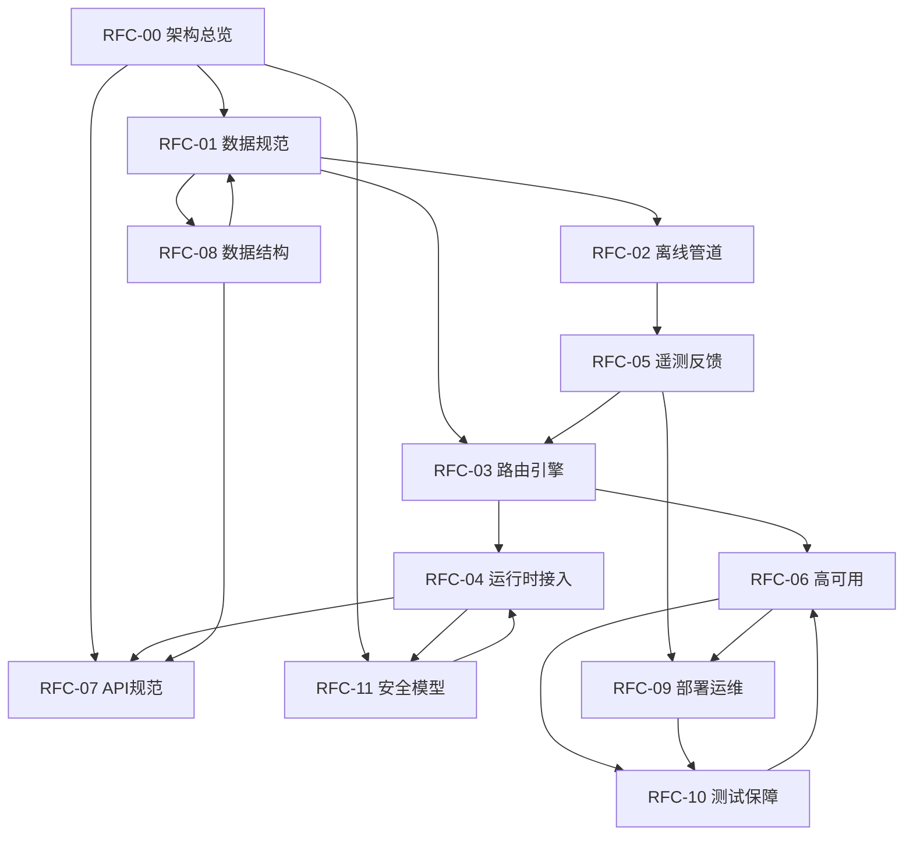

# GraphSkill RFC 文档集规划书

**版本:** 1.0  
**创建日期:** 2026-04-12  
**状态:** 进行中  
**作者:** Principal Systems Architect

---

## 1. 文档集概述

本文档集旨在为 GraphSkill 项目构建一套达到 Apache 开源基金会顶级项目标准的工业级核心架构文档。所有文档严格遵循 IETF RFC 2119 规范用语，覆盖系统架构的各个子领域。

### 1.1 文档集设计原则

- **高内聚低耦合:** 每份文档聚焦单一子领域，避免内容重叠
- **可执行性:** 包含大量数据结构定义、接口签名、系统边界定义
- **容错性:** 明确描述兜底容错逻辑
- **规范性:** 严格使用 RFC 2119 规范用语（MUST, MUST NOT, REQUIRED, SHALL, SHALL NOT, SHOULD, SHOULD NOT, RECOMMENDED, MAY, OPTIONAL）

### 1.2 RFC 2119 规范用语速查

| 关键词 | 含义 |
|--------|------|
| **MUST** / **REQUIRED** / **SHALL** | 绝对要求，不允许任何偏离 |
| **MUST NOT** / **SHALL NOT** | 绝对禁止 |
| **SHOULD** / **RECOMMENDED** | 推荐做法，特殊情况下可偏离但需充分理由 |
| **SHOULD NOT** / **NOT RECOMMENDED** | 不推荐做法，特殊情况下可采用但需充分理由 |
| **MAY** / **OPTIONAL** | 可选项，由实现者自行决定 |

---

## 2. RFC 文档索引

### RFC-00: 架构总览与索引 (Architecture Overview & Index)
**状态:** [ ] 待完成  
**核心摘要:**  
作为系统的总起文档，提供 GraphSkill 的宏观架构视图。包含系统定位、核心设计理念、四大组件拓扑关系、数据流向总览、技术栈选型依据、以及本文档集的导航索引。定义系统边界与外部依赖接口，阐述"拓扑感知"与"过程性知识路由"的核心概念。

---

### RFC-01: 数据规范与存储层设计 (Data Specification & Storage Layer)
**状态:** [ ] 待完成  
**核心摘要:**  
定义 Skill Manifest Schema 规范、图数据库数据模型（节点属性、边语义）、向量数据库 Schema、图-向量双写一致性保障机制、事务边界定义、数据生命周期管理、以及数据迁移策略。包含完整的 JSON/YAML Schema 定义和数据库索引设计。

---

### RFC-02: 离线图谱构建管道 (Offline Ingestion Pipeline)
**状态:** [ ] 待完成  
**核心摘要:**  
详述 SKILL.md 解析流程、AST 语法树生成、Frontmatter 校验、静态检查引擎、自动化拓扑边抽取算法（基于 LLM 的关系推演）、图结构连通性与环路校验（DAG 约束）、批量导入策略、以及增量更新机制。定义解析器接口规范和错误处理策略。

---

### RFC-03: 在线动态路由引擎 (Online Routing Gateway)
**状态:** [ ] 待完成  
**核心摘要:**  
GraphSkill 的核心技术资产。详述输入标准化与意图向量化、拓扑感知混合召回算法（Semantic Seed Recall + Graph Expansion）、动态打分函数设计、最大权重独立集（MWIS）冲突剪枝算法、上下文拼装与 Token 截断策略、以及缓存策略。包含算法伪代码、时间复杂度分析和性能基准。

---

### RFC-04: Agent 运行时接入层 (Runtime Integration Layer)
**状态:** [ ] 待完成  
**核心摘要:**  
定义技能注入中间件协议、输出规范（XML 标签包裹、Tool Call JSON Schema）、细粒度权限拦截器设计、鉴权逻辑、会话管理、以及与主流 Agent 框架（LangChain、AutoGen、OpenDevin）的集成规范。定义标准化的上下文外壳接口。

---

### RFC-05: 遥测监控与自我进化反馈循环 (Telemetry & Self-Evolution Feedback Loop)
**状态:** [ ] 待完成  
**核心摘要:**  
定义埋点规范、运行时状态追踪、遥测数据格式、Kafka Topic 设计、节点可靠性衰减算法、隐性边发现与边权强化机制、冲突边自发现算法、以及后台作业调度策略。阐述基于强化学习思想的图谱自愈与自我进化能力。

---

### RFC-06: 性能安全与高可用规范 (Performance, Security & High Availability)
**状态:** [ ] 待完成  
**核心摘要:**  
定义缓存策略与降级机制（Graph Cache、Fallback 模式）、高并发隔离与连接池管理、请求限流与熔断策略、安全边界隔离、不可信载荷处理规范、以及容灾恢复流程。包含性能基准指标和 SLA 定义。

---

### RFC-07: API 接口规范 (API Interface Specification)
**状态:** [ ] 待完成  
**核心摘要:**  
定义所有 REST/gRPC API 端点、请求/响应 Schema、错误码体系、版本控制策略、认证授权机制、以及 API 兼容性承诺。包含 OpenAPI 3.0 规范定义和接口示例。

---

### RFC-08: 数据结构与 Schema 定义 (Data Structures & Schema Definitions)
**状态:** [ ] 待完成  
**核心摘要:**  
汇总所有核心数据结构定义，包括 SkillNode、Edge、ConflictGraph、RoutingContext、TelemetryEvent 等。提供完整的 JSON Schema、Protocol Buffers 定义、以及序列化规范。作为跨模块数据契约的单一真相来源。

---

### RFC-09: 部署与运维规范 (Deployment & Operations)
**状态:** [ ] 待完成  
**核心摘要:**  
定义容器化部署策略、Kubernetes Helm Chart 配置、服务发现与注册、配置管理、日志规范、监控告警体系、以及运维手册。包含生产环境部署检查清单和故障排查指南。

---

### RFC-10: 测试与质量保障规范 (Testing & Quality Assurance)
**状态:** [ ] 待完成  
**核心摘要:**  
定义单元测试、集成测试、端到端测试、性能测试、混沌工程测试规范。包含测试覆盖率要求、Mock 策略、测试数据管理、以及 CI/CD 流水线集成规范。定义质量门禁和发布准则。

---

### RFC-11: 安全与权限模型 (Security & Permission Model)
**状态:** [ ] 待完成  
**核心摘要:**  
定义细粒度权限声明规范（permissions 字段）、权限校验流程、沙箱隔离机制、敏感数据处理规范、审计日志、以及安全漏洞响应流程。包含威胁模型分析和安全最佳实践。

---

## 3. 文档依赖关系图

## 4. 进度追踪

| RFC 编号 | 标题 | 状态 | 完成日期 |
|----------|------|------|----------|
| RFC-00 | 架构总览与索引 | [x] 已完成 | 2026-04-12 |
| RFC-01 | 数据规范与存储层设计 | [x] 已完成 | 2026-04-12 |
| RFC-02 | 离线图谱构建管道 | [x] 已完成 | 2026-04-12 |
| RFC-03 | 在线动态路由引擎 | [x] 已完成 | 2026-04-12 |
| RFC-04 | Agent 运行时接入层 | [x] 已完成 | 2026-04-12 |
| RFC-05 | 遥测监控与自我进化反馈循环 | [x] 已完成 | 2026-04-12 |
| RFC-06 | 性能安全与高可用规范 | [x] 已完成 | 2026-04-12 |
| RFC-07 | API 接口规范 | [x] 已完成 | 2026-04-12 |
| RFC-08 | 数据结构与 Schema 定义 | [x] 已完成 | 2026-04-12 |
| RFC-09 | 部署与运维规范 | [x] 已完成 | 2026-04-12 |
| RFC-10 | 测试与质量保障规范 | [x] 已完成 | 2026-04-12 |
| RFC-11 | 安全与权限模型 | [x] 已完成 | 2026-04-12 |

**文档集完成状态:** ✅ 全部完成 (12/12)

---

## 5. 变更日志

| 版本 | 日期 | 变更内容 | 作者 |
|------|------|----------|------|
| 1.0 | 2026-04-12 | 初始规划文档创建 | Principal Systems Architect |
| 1.1 | 2026-04-12 | 完成 RFC-00 至 RFC-11 全部文档 | Principal Systems Architect |

---

## 6. 下一步行动

1. ✅ 按照依赖关系顺序，从 RFC-00 开始逐个创建文档
2. ✅ 每完成一份文档，更新本文档的进度追踪表
3. ✅ 确保文档间交叉引用的一致性
4. 🔄 最终进行全文档集的审校和术语统一（建议进行）